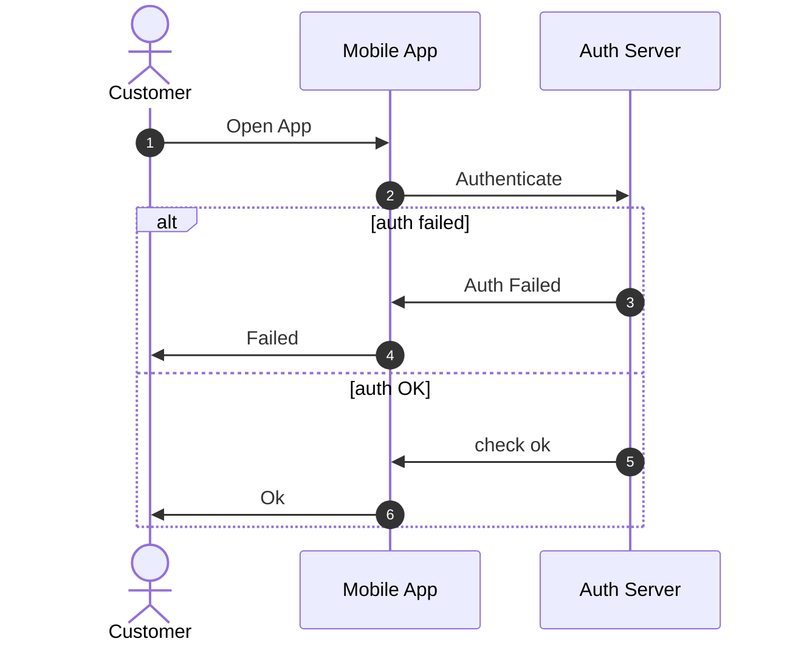

#Login Journey flow

```mermaid
sequenceDiagram
autonumber
  actor U as Customer
  participant MA as Mobile App
  participant AU as Auth Server

U->>MA: Open App
MA->>AU: Authenticate
alt auth failed
  AU->>MA: Auth Failed
  MA->>U: Failed
else auth OK
  AU->>MA: check ok
  MA->>U: Ok
end
```
